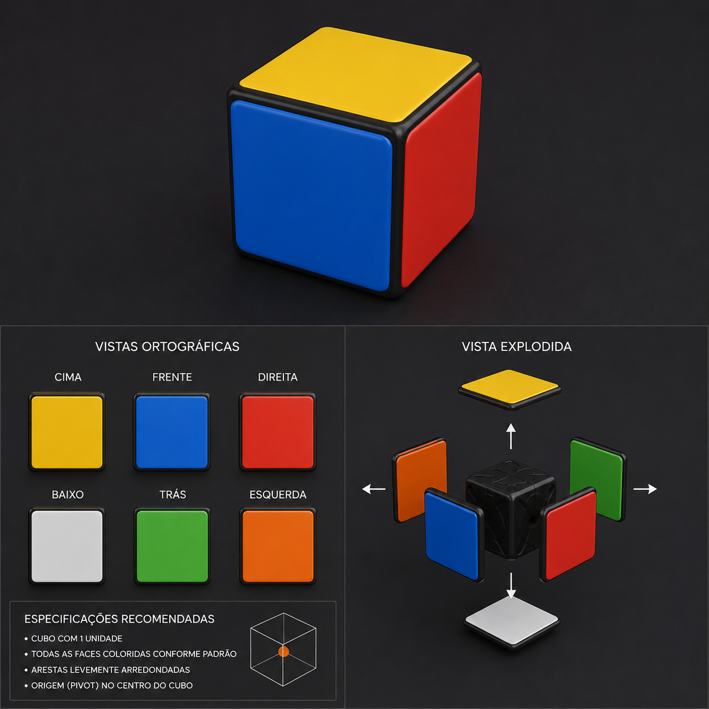

# 🧩 3D Rubik's Cube Challenge

An interactive Rubik’s Cube simulator developed with **Three.js**, focused on precise 3D object manipulation and state logic.

## 🚀 Features

- **Natural Interaction:** Face selection through *Raycasting* and drag direction detection for intuitive rotations.
- **Layer Logic:** Dynamic rotation system using a *Pivot* object to correctly group and rotate cube pieces along the X, Y, and Z axes.
- **Random Shuffle:** *Shuffle* function that performs a sequence of random moves (press the "S" key) to generate a new challenge.
- **Win Detection:** Algorithm that compares current positions with the original ones to validate puzzle completion.
- **Minimalist Interface:** Clean HUD with integrated instructions, titles, and developer credits.

## 🛠️ Model Specifications

The project uses a 3D model configured with standard Rubik’s Cube colors and rounded edges for a premium visual experience.

## 🕹️ How to Play

1. **Rotate:** Click and drag (horizontally or vertically) on a cube face to rotate the corresponding layer.
2. **Camera:** Use the left/right mouse button to orbit and inspect the cube from different angles.
3. **Shuffle:** Press the **"S"** key on the keyboard to start the shuffle sequence.
4. **Objective:** Solve the cube by moving the pieces back to their original positions.

## 💻 Technologies Used

- **Three.js:** Main engine for 3D rendering.
- **GLTFLoader:** Used to load and instantiate the cube pieces.
- **OrbitControls:** Smooth camera navigation.
- **JavaScript ES6:** Game logic and array manipulation.

---

## 👨‍💻 Developer

Project developed by **Bruno Cipriano Ribeiro**.

LINKZIM
